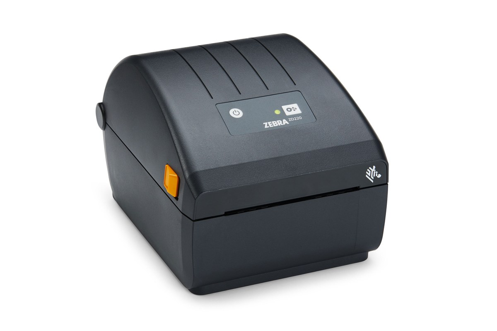

# PostNL 10x15 Virtual Printer

[**Nederlands**](#nederlands) · [**English**](#english)

## Nederlands

Zelfstandig Windows 11-project om een PostNL A4-verzendlabel automatisch uit
te snijden, naar exact 150 x 100 mm om te zetten en door te sturen naar een
geïnstalleerde labelprinter.

De moderne virtuele printer vereist Windows 11 24H2 (build 26100) of nieuwer.

## Downloaden

[**Download de nieuwste installatie**](https://github.com/elek-tron/PostNL_10x15_Virtual_Printer/releases/latest)

Download op de releasepagina het ZIP-bestand dat begint met
`PostNL-10x15-Printer-Windows-11`, pak het volledig uit en dubbelklik op
`INSTALLEREN.cmd`.

## Systeemvereisten

Voor installatie en normaal gebruik:

- Windows 11 24H2 (build 26100) of nieuwer
- een 64-bits Windows-computer
- een reeds geïnstalleerde printer, bij voorkeur met ongeveer 100 x 150 mm
  (4 x 6 inch) als standaard papierformaat
- beheerdersrechten tijdens de installatie

.NET 8 Desktop Runtime is niet standaard gegarandeerd aanwezig in Windows 11.
De complete installer controleert dit automatisch en installeert de
meegeleverde runtime en benodigde Windows-app-onderdelen alleen wanneer ze
ontbreken. De gebruiker hoeft .NET dus niet afzonderlijk te downloaden.

Voor het bouwen vanuit de broncode zijn daarnaast de .NET 8 SDK en Windows 11
SDK 10.0.26100 nodig.

## Van A4 naar 10 x 15 cm

| PostNL-label op A4 | Automatisch uitgesneden naar 10 x 15 cm |
| --- | --- |
|  |  |

De adressen, barcode en het zendingsnummer in deze voorbeelden zijn voor
privacy onleesbaar gemaakt. Het programma gebruikt geen vaste uitsnede en
hoeft niet te worden gekalibreerd.

## Eenvoudige printerinstellingen


De gebruiker hoeft geen papierformaat of afdrukstand te kiezen. De virtuele
printer gebruikt altijd 10 x 15 cm, bepaalt de stand automatisch en verwijdert
de witte A4-randen.

## Printers

- Test: `PDF24`
- Praktijk: iedere Windows-labelprinter met ongeveer 100 x 150 mm als
  standaard papierformaat

De doelprinter wordt tijdens de installatie gekozen uit de bestaande
Windows-printers. Een printer met ongeveer 100 x 150 mm (ook 4 x 6 inch)
als standaard papierformaat wordt automatisch voorgeselecteerd, ongeacht merk
of type. De keuze wordt voor de huidige gebruiker bewaard.



*Voorbeeld: Zebra ZD220. Het programma werkt ook met labelprinters van andere
merken die ongeveer 100 x 150 mm ondersteunen.*

## Veilige testvolgorde

```powershell
dotnet run --project src/PostNL10x15.Worker -- printers
dotnet run --project src/PostNL10x15.Worker -- inspect "invoer.pdf"
dotnet run --project src/PostNL10x15.Worker -- crop "invoer.pdf" "output\label-10x15.pdf"
dotnet run --project src/PostNL10x15.Worker -- print "invoer.pdf" --printer "PDF24"
```

Alleen het laatste commando start een Windows-printopdracht.

## Opbouw

- `PostNL10x15.Core`: detecteert de rand van het label en maakt een vector-PDF
  van exact 150 x 100 mm, zonder handmatige kalibratie.
- `PostNL10x15.Worker`: rendert op 8 dots/mm en print naar een gekozen
  Windows-printer.
- `PostNL10x15.VirtualPrinter`: ontvangt PDF, OXPS of PostScript van de
  Windows-afdrukroute en start de worker onzichtbaar.
- `packaging/VirtualPrinter`: moderne Windows 11-printerconfiguratie. De
  interne A4-invoer blijft behouden voor een scherpe uitsnede, maar de
  gebruiker ziet alleen de vaste uitvoer van 10 x 15 cm.

## Werking

De virtuele printer `PostNL 10x15` is end-to-end getest met een echt
PostNL-label. De A4-witruimte wordt zonder kalibratie verwijderd, waarna een
PDF van exact 150 x 100 mm naar de gekozen printer gaat. De uiteindelijke
testversie is 0.3.5. Deze versie gebruikt een herkenbaar label-met-schaar-icoon
dat ook in de kleine Windows-appweergave duidelijk zichtbaar blijft. Het
versienummer staat expliciet in de zichtbare appnaam. De printereigenschappen
tonen geen verwarrende lijst met papierformaten of portret/landschap meer:
alleen 10 x 15 cm, automatische stand en automatische uitsnede.
Op een Nederlandstalige Windows-installatie zijn deze teksten Nederlands.
Bij iedere andere Windows-taal wordt automatisch Engels gebruikt.
Na de eerste Windows-afdrukknop verschijnt een duidelijk voorbeeld van het
uitgesneden label. Pas na **Afdrukken** gaat het naar de gekozen labelprinter;
met **Annuleren** wordt niets afgedrukt.

## Zelfstandig pakket bouwen

```powershell
.\scripts\Publish-Worker.ps1
```

Dit maakt `artifacts\worker-win-x64`. Daarin zitten de .NET-runtime en
PDF-renderer; het oude PostNL-programma of Adobe Reader is niet nodig. Deze
worker wordt later onzichtbaar in het MSIX-printerpakket opgenomen.

## Virtuele printer installeren

Gebruik voor een andere computer de complete map of ZIP
`PostNL 10x15 Printer - Installatie Windows 11 v0.3.5`. Dubbelklik daarin op
`INSTALLEREN.cmd`, kies een bestaande doelprinter uit de lijst en kies daarna
**Ja** bij de Windows-beheerdersvraag.
Een printer met ongeveer 100 x 150 mm als standaard papierformaat staat
automatisch geselecteerd. Als die niet wordt gevonden, wordt PDF24 als
testdoel gekozen wanneer die aanwezig is. Het lokale ontwikkelcertificaat
wordt alleen gebruikt om dit zelfgebouwde MSIX-pakket op deze pc te vertrouwen.
Daarna verschijnt `PostNL 10x15` in de Windows-printerlijst.

Start dezelfde installer later opnieuw om de doelprinter van PDF24 naar de
labelprinter te wijzigen of een nieuwere pakketversie te installeren. De
meegeleverde .NET 8 Desktop Runtime en Windows-app-onderdelen worden alleen
geïnstalleerd wanneer die ontbreken.

## Licentie

Dit project is beschikbaar onder de [MIT-licentie](LICENSE).

## Totstandkoming

De broncode, installatiebestanden en documentatie in deze repository zijn
volledig gemaakt met OpenAI Codex, gebaseerd op GPT-5. De projecteigenaar
bepaalde de functionele wensen en voerde de praktijktests uit.

## Merken

Dit onafhankelijke project is niet verbonden aan of goedgekeurd door PostNL of
Zebra Technologies. PostNL en Zebra zijn merken van hun respectieve
eigenaren.

---

## English

Standalone Windows 11 project that automatically crops a PostNL A4 shipping
label, converts it to exactly 150 x 100 mm, and forwards it to an installed
label printer.

The modern virtual printer requires Windows 11 24H2 (build 26100) or newer.

### Download

[**Download the latest installer**](https://github.com/elek-tron/PostNL_10x15_Virtual_Printer/releases/latest)

On the release page, download the ZIP file whose name starts with
`PostNL-10x15-Printer-Windows-11`, extract it completely, and double-click
`INSTALLEREN.cmd`.

### System requirements

For installation and normal use:

- Windows 11 24H2 (build 26100) or newer
- a 64-bit Windows computer
- an existing printer, preferably configured with approximately 100 x 150 mm
  (4 x 6 inch) as its default paper size
- administrator rights during installation

.NET 8 Desktop Runtime is not guaranteed to be included with Windows 11. The
complete installer checks for it automatically and installs the bundled
runtime and required Windows app components only when they are missing. The
user does not have to download .NET separately.

Building the project from source additionally requires the .NET 8 SDK and
Windows 11 SDK 10.0.26100.

### From A4 to 10 x 15 cm

| PostNL label on A4 | Automatically cropped to 10 x 15 cm |
| --- | --- |
|  |  |

The addresses, barcode, and shipment number in these examples have been made
unreadable for privacy. The program does not use a fixed crop and does not
require calibration.

### Simple printer settings


The user does not have to select a paper size or orientation. The virtual
printer always uses 10 x 15 cm, determines the orientation automatically, and
removes the white A4 margins.

### Printers

- Testing: `PDF24`
- In practice: any Windows label printer with approximately 100 x 150 mm as
  its default paper size

During installation, the destination printer is selected from the existing
Windows printers. A printer configured with approximately 100 x 150 mm
(also 4 x 6 inch) as its default paper size is automatically preselected,
regardless of brand or model. The selection is stored for the current user.


*Example: Zebra ZD220. The program also works with label printers from other
brands that support approximately 100 x 150 mm.*

### Safe testing sequence

```powershell
dotnet run --project src/PostNL10x15.Worker -- printers
dotnet run --project src/PostNL10x15.Worker -- inspect "input.pdf"
dotnet run --project src/PostNL10x15.Worker -- crop "input.pdf" "output\label-10x15.pdf"
dotnet run --project src/PostNL10x15.Worker -- print "input.pdf" --printer "PDF24"
```

Only the final command starts a Windows print job.

### Architecture

- `PostNL10x15.Core`: detects the label boundary and creates a vector PDF of
  exactly 150 x 100 mm without manual calibration.
- `PostNL10x15.Worker`: renders at 8 dots/mm and prints to a selected Windows
  printer.
- `PostNL10x15.VirtualPrinter`: receives PDF, OXPS, or PostScript from the
  Windows printing route and starts the worker invisibly.
- `packaging/VirtualPrinter`: modern Windows 11 printer configuration. The
  internal A4 input is retained for a sharp crop, while the user sees only
  the fixed 10 x 15 cm output.

### Operation

The `PostNL 10x15` virtual printer has been tested end to end with a real
PostNL label. The A4 white space is removed without calibration, after which
a PDF of exactly 150 x 100 mm is sent to the selected printer. The current
test version is 0.3.5.

This version uses a recognizable label-and-scissors icon that remains clear
in the small Windows app view. The version number is included in the visible
app name. The printer properties no longer show a confusing list of paper
sizes or portrait/landscape choices: only 10 x 15 cm, automatic orientation,
and automatic cropping.

The interface is shown in Dutch on a Dutch Windows installation and in English
for every other Windows display language. After the first Windows print
button, a clear preview of the cropped label is displayed. The job is sent to
the selected label printer only after selecting **Print**; selecting
**Cancel** prints nothing.

### Building a self-contained package

```powershell
.\scripts\Publish-Worker.ps1
```

This creates `artifacts\worker-win-x64`. It contains the .NET runtime and PDF
renderer, so the old PostNL program and Adobe Reader are not required. The
worker is subsequently included invisibly in the MSIX printer package.

### Installing the virtual printer

For another computer, use the complete folder or ZIP archive
`PostNL 10x15 Printer - Installatie Windows 11 v0.3.5`. Double-click
`INSTALLEREN.cmd`, select an existing destination printer, and then select
**Yes** when Windows asks for administrator permission.

A printer configured with approximately 100 x 150 mm as its default paper
size is selected automatically. If none is found, PDF24 is selected as the
test destination when available. The local development certificate is used
only to trust this self-built MSIX package on the computer. `PostNL 10x15`
then appears in the Windows printer list.

Run the same installer again later to change the destination from PDF24 to the
label printer or to install a newer package version. The bundled .NET 8
Desktop Runtime and Windows app components are installed only when missing.

### License

This project is available under the [MIT License](LICENSE).

### Project creation

The source code, installation files, and documentation in this repository
were created entirely with OpenAI Codex, based on GPT-5. The project owner
defined the functional requirements and performed the practical tests.

### Trademarks

This independent project is not affiliated with or endorsed by PostNL or
Zebra Technologies. PostNL and Zebra are trademarks of their respective
owners.
