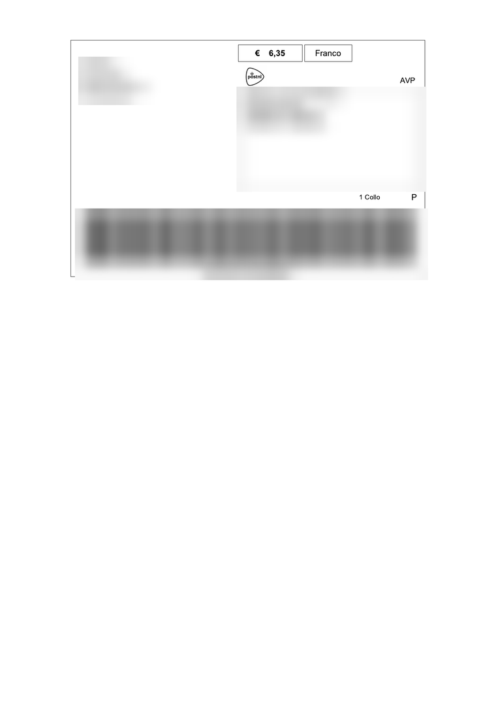
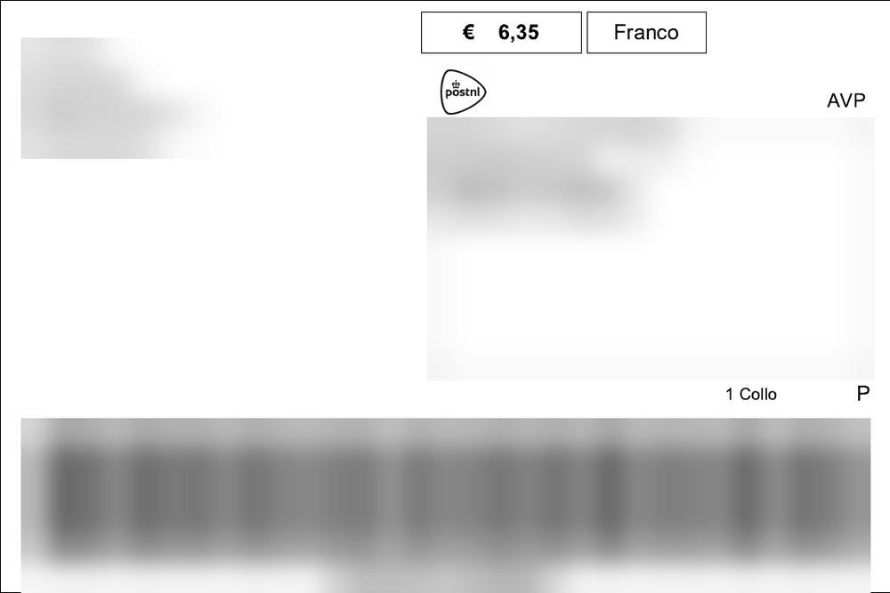
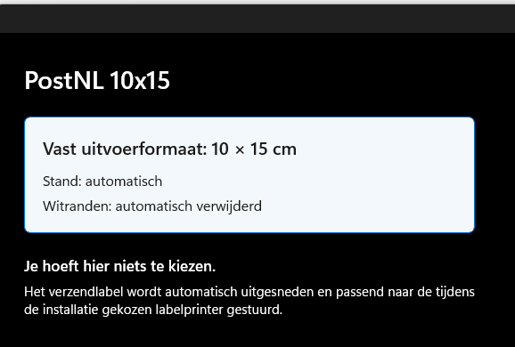

# PostNL 10x15 Virtual Printer

Zelfstandig Windows 11-project om een PostNL A4-verzendlabel automatisch uit
te snijden, naar exact 150 x 100 mm om te zetten en door te sturen naar een
geinstalleerde printer.

De moderne virtuele printer vereist Windows 11 24H2 (build 26100) of nieuwer.

## Downloaden

[**Download de nieuwste installatie**](https://github.com/elek-tron/PostNL_10x15_Virtual_Printer/releases/latest)

Download op de releasepagina het ZIP-bestand dat begint met
`PostNL-10x15-Printer-Windows-11`, pak het volledig uit en dubbelklik op
`INSTALLEREN.cmd`.

## Systeemvereisten

Voor installatie en normaal gebruik:

- Windows 11 24H2 (build 26100) of nieuwer
- een 64-bits Windows-computer
- een reeds geïnstalleerde printer, bij voorkeur met ongeveer 100 x 150 mm
  (4 x 6 inch) als standaard papierformaat
- beheerdersrechten tijdens de installatie

.NET 8 Desktop Runtime is niet standaard gegarandeerd aanwezig in Windows 11.
De complete installer controleert dit automatisch en installeert de
meegeleverde runtime en benodigde Windows-app-onderdelen alleen wanneer ze
ontbreken. De gebruiker hoeft .NET dus niet afzonderlijk te downloaden.

Voor het bouwen vanuit de broncode zijn daarnaast de .NET 8 SDK en Windows 11
SDK 10.0.26100 nodig.

## Van A4 naar 10 x 15 cm

| PostNL-label op A4 | Automatisch uitgesneden naar 10 x 15 cm |
| --- | --- |
|  |  |

De adressen, barcode en het zendingsnummer in deze voorbeelden zijn voor
privacy onleesbaar gemaakt. Het programma gebruikt geen vaste uitsnede en
hoeft niet te worden gekalibreerd.

## Eenvoudige printerinstellingen



De gebruiker hoeft geen papierformaat of afdrukstand te kiezen. De virtuele
printer gebruikt altijd 10 x 15 cm, bepaalt de stand automatisch en verwijdert
de witte A4-randen.

## Printers

- Test: `PDF24`
- Praktijk: iedere Windows-labelprinter met ongeveer 100 x 150 mm als
  standaard papierformaat

De doelprinter wordt tijdens de installatie gekozen uit de bestaande
Windows-printers. Een printer met ongeveer 100 x 150 mm (ook 4 x 6 inch)
als standaard papierformaat wordt automatisch voorgeselecteerd, ongeacht merk
of type. De keuze wordt voor de huidige gebruiker bewaard.

## Veilige testvolgorde

```powershell
dotnet run --project src/PostNL10x15.Worker -- printers
dotnet run --project src/PostNL10x15.Worker -- inspect "invoer.pdf"
dotnet run --project src/PostNL10x15.Worker -- crop "invoer.pdf" "output\label-10x15.pdf"
dotnet run --project src/PostNL10x15.Worker -- print "invoer.pdf" --printer "PDF24"
```

Alleen het laatste commando start een Windows-printopdracht.

## Opbouw

- `PostNL10x15.Core`: detecteert de rand van het label en maakt een vector-PDF
  van exact 150 x 100 mm, zonder handmatige kalibratie.
- `PostNL10x15.Worker`: rendert op 8 dots/mm en print naar een gekozen
  Windows-printer.
- `PostNL10x15.VirtualPrinter`: ontvangt PDF, OXPS of PostScript van de
  Windows-afdrukroute en start de worker onzichtbaar.
- `packaging/VirtualPrinter`: moderne Windows 11-printerconfiguratie. De
  interne A4-invoer blijft behouden voor een scherpe uitsnede, maar de
  gebruiker ziet alleen de vaste uitvoer van 10 x 15 cm.

## Werking

De virtuele printer `PostNL 10x15` is end-to-end getest met een echt
PostNL-label. De A4-witruimte wordt zonder kalibratie verwijderd, waarna een
PDF van exact 150 x 100 mm naar de gekozen printer gaat. De uiteindelijke
testversie is 0.3.5. Deze versie gebruikt een herkenbaar label-met-schaar-icoon
dat ook in de kleine Windows-appweergave duidelijk zichtbaar blijft. Het
versienummer staat expliciet in de zichtbare appnaam. De printereigenschappen
tonen geen verwarrende lijst met papierformaten of portret/landschap meer:
alleen 10 x 15 cm, automatische stand en automatische uitsnede.
Op een Nederlandstalige Windows-installatie zijn deze teksten Nederlands.
Bij iedere andere Windows-taal wordt automatisch Engels gebruikt.
Na de eerste Windows-afdrukknop verschijnt een duidelijk voorbeeld van het
uitgesneden label. Pas na **Afdrukken** gaat het naar de gekozen labelprinter;
met **Annuleren** wordt niets afgedrukt.

## Zelfstandig pakket bouwen

```powershell
.\scripts\Publish-Worker.ps1
```

Dit maakt `artifacts\worker-win-x64`. Daarin zitten de .NET-runtime en
PDF-renderer; het oude PostNL-programma of Adobe Reader is niet nodig. Deze
worker wordt later onzichtbaar in het MSIX-printerpakket opgenomen.

## Virtuele printer installeren

Gebruik voor een andere computer de complete map of ZIP
`PostNL 10x15 Printer - Installatie Windows 11 v0.3.5`. Dubbelklik daarin op
`INSTALLEREN.cmd`, kies een bestaande doelprinter uit de lijst en kies daarna
**Ja** bij de Windows-beheerdersvraag.
Een printer met ongeveer 100 x 150 mm als standaard papierformaat staat
automatisch geselecteerd. Als die niet wordt gevonden, wordt PDF24 als
testdoel gekozen wanneer die aanwezig is. Het lokale ontwikkelcertificaat
wordt alleen gebruikt om dit zelfgebouwde MSIX-pakket op deze pc te vertrouwen.
Daarna verschijnt `PostNL 10x15` in de Windows-printerlijst.

Start dezelfde installer later opnieuw om de doelprinter van PDF24 naar de
labelprinter te wijzigen of een nieuwere pakketversie te installeren. De
meegeleverde .NET 8 Desktop Runtime en Windows-app-onderdelen worden alleen
geïnstalleerd wanneer die ontbreken.

## Licentie

Dit project is beschikbaar onder de [MIT-licentie](LICENSE).

## Totstandkoming

De broncode, installatiebestanden en documentatie in deze repository zijn
volledig gemaakt met OpenAI Codex, gebaseerd op GPT-5. De projecteigenaar
bepaalde de functionele wensen en voerde de praktijktests uit.
